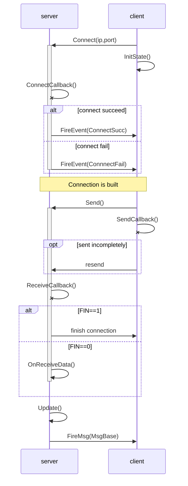

#         SUSTCMajiang network framework

11710208 XTY

## module description

### 1. class ByteArray

1.1 module function

ByteArray is a class which solve the problem of send and receive message correctly and reliably.

ByteArray has a member variable "public byte[] bytes". bytes is the buffer which stores the messages received but not been read by application.  

1.2 module's advantages:

ByteArray has a great space-using efficiency. Cause that it maintain a buffer bytes dynamically. If the messages received is larger than the remain space of buffer, ByteArray will ask for more space. In addition, if most of the messages in buffer is read by application, the space of read messages in buffer will be used for future receiving. 


1.3 description of some member function

```c#
public int Read(byte[] bs, int offset, int count)
```

It is the function used by applications to read messages from the buffer. The input parameter byte[] *bs* is the store buffer in application, *offset* is the write_index of the application buffer. *count* is the size of messages to read. After copy the message to *bs*. It will call the CheckAndMoveBytes() function to try to release some space in buffer.

```c#
public int Write(byte[] bs, int offset, int count)
```

It is the function to receive the messages. It will first check the remain space and the size of received messages. If the remain space is not enough, it will call the ReSize(int size) function to enlarge the buffer.

### 2. class MsgBase

2.1 module function

This class is used to solve the affairs about the protocol, such as encode and decode. All the protocols are encapsulated into MsgBase, which enable other class to send or receive protocol conveniently.

2.2 description of some member function

```c#
public static byte[] Encode(MsgBase msgBase)
```

 The program uses "*JsonUtility.ToJson*" to convert the body of the protocol to a string, and then uses "*System. Text. Encoding. Utf8.getbytes*" to convert the string to a byte array. 

```c#
public static MsgBase Decode(string protoName, byte[] bytes, int offset, int count)
```

 The decoding method Decode will first parse part of the byte array into a string using *"System.Text.Encoding. Utf8.Getstring"* and then use *"JsonUtility.FromJson"* to restore the string to a protocol object of the specified type. The Type of the protocol object is specified by the protocol name, and the program uses *"Type.GetType (ProtoName)"* to get the corresponding Type. 

```c#
public static byte[] EncodeName(MsgBase msgBase)
```

This function input a MsgBase instantiation.  Then it will parse the byte array into bytes using *"System.Text.Encoding. Utf8.GetBytes"* . Next it will get the length of bytes, and combine the length and the message bytes together as bytes array. Then return this bytes array.

```c#
public static string DecodeName(byte[] bytes, int offset, out int count)
```

This function will decode the bytes encoded by the *"EncodeName()"* function. It will separate the length information and the real messages. At last it will return a string got by *"System.Text.Encoding.UTF8.GetString"* .

### 3. class NetManager

3.1 model function

This module has complicated structure and variable functions as well. 

- This module uses Observer Pattern to build the structure of how to solve the messages about connection and send/receive messages.

- It also provide the Connect function , AddEventListener function and Send function to other caller.

- This module imports the last two modules l described before, *MsgBase* and *ByteArray*.  They are used as the receive buffer and writeQueue in *NetManager* module, which brings it a good space efficiency.

All in all, *NetManager* provide clients the function of connecting the server and duplex send/receive messages.

3.2 description of some member function

```c#
public static void Update()
```

module Network is built on the basis of asynchronous socket. The  callback function of asynchronous socket store messages in *msgList*, which is the buffer of received message. *Update()* read the messages from *msgList* in order. Then it will call the function *FireMsg()*,which is the function to solve the correlative messages.

```c#
public delegate void EventListener(String err);
private static Dictionary<NetEvent, EventListener> eventListeners = new 				      Dictionary<NetEvent, EventListener>();
```

*eventListeners* is a dictionary which can record the callback method of every NetEvent. If a NetEvent happens, it will call the callback method of relevant Event one by one.

```c#
public static void AddEventListener(NetEvent netEvent, EventListener listener);
public static void RemoveEventListener(NetEvent netEvent, EventListener listener);
```

These two functions are used to add/remove NetEvent and its relevant callback method to/from the *eventListeners*. 

```c#
private static void FireEvent(NetEvent netEvent, String err)
```

The input parameters of this function is a NetEvent and the index of its callback method. *FireEvent()* will first

check if the dictionary contain the NetEvent input, if the answer is true. It will call the relevant callback method.

```c#
public static void Connect(string ip, int port);
private static void InitState();
private static void ConnectCallback(IAsyncResult ar);
```

*Connect()* function will check the connection state of socket at first. If the socket is in idle, it will call the *socket.BeginConnect()* function to build a connection. 

Before build the connection, we should reset the readbuffer, writeQueue, msgList and other member variables. This is the function of  *InitState()* member method.

After the *Connect()* is executed, the *ConnectCallback()* method will be called. If the connection succeeds, it will trigger the *ConnectSucc* NetEvent, else it will trigger the *ConnectFail* NetEvent. Finally, it will change the state *isConnecting* from True to False.

```c#
public static void Send(MsgBase msg);
public static void SendCallback(IAsyncResult ar);
```

*Send*() will first parse the input parameter MsgBase msg and get the encode data of protocol name and protocol body. *SendCallback()* is the callback function of *Send()* . It can guarantee the integrity of sending.

 *Send()* manager the writeQueue together with *SendCallback*() . The function of writeQueue is important. Firstly, it can control the data not to send multiple packets continuously without receive the response from the *SendCallback()*.  If the size of writeQueue is not 1, *Send()* won't send new packets,but buffer them in the writeQueue. 

Secondly, in *SendCallback()* it will check if the writeQueue is empty. If not, it means that the packets is not send completely and need to send again. It can guarantee the integrity of sending.

```c#
public delegate void MsgListener(MsgBase msgBase);
private static Dictionary<string, MsgListener> msgListeners = new Dictionary<string, MsgListener>();
public static void AddMsgListener(string msgName, MsgListener listener);
public static void RemoveMsgListener(string msgName, MsgListener listener);
private static void FireMsg(string msgName, MsgBase msgBase);
    
```

The structure of MsgListener here is very similar to the NetEvent Listener.  The only difference is that it deal with the game message instead of network message. And it use protocol name as the key of Message Event instead of *NetEvent* . It makes the contribution on the Observer Pattern of class ***NetManager***

```c#
public static void ReceiveCallback(IAsyncResult ar);
public static void OnReceiveData();
```

The *ReceiveCallback()* will receive the message and solve them. If the FIN==1, it will finish the connection, else it will save the data into the buffer *readBuff* and call the *OnReceiveData()* to parse the data.

*ReceiveCallback()* has two functions, the first is to estimate the completeness of data, if it is not complete, the function will finish. The second is to parse the protocol objection from the data and add it into the *msgList*. 

Because the *msgList* is run on the asynchronous way, so *OnReceiveData()* will lock the *msgList* during its execution.

```pseudocode
private static void PingUpdate();
private static void OnMsgPong( MsgBase msgBase);
private static void InitState();
```

These functions realize the heartbeat mechanism. The heartbeat mechanism is used to detect the connection between client and server. If the connection is broken, server will release the socket source. 

Client will continuously send the *MsgPing* to the server every 30 seconds. And the server will monitor the *MsgPing* from client and response a *MsgPong* back to client. If the client do not receive the *MsgPong* for a relevant long time, it will release the socket resource.


## Sequence Graph




